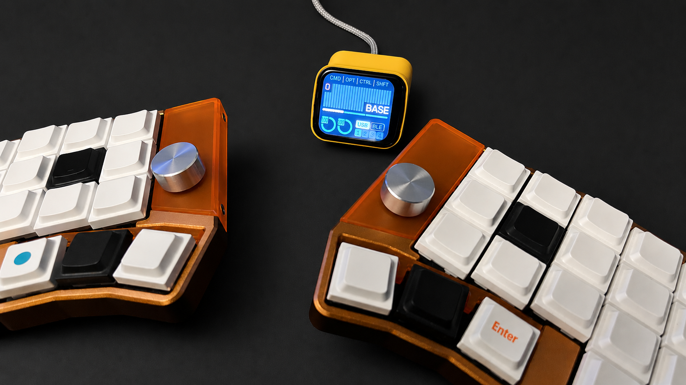
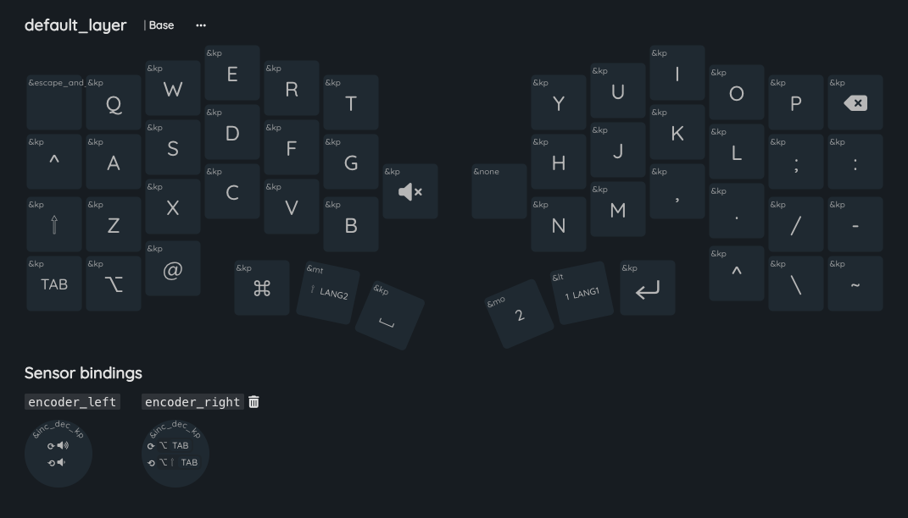

# ZMK Keyboard for Cornix (Prospector edition)

ZMK firmware for the Cornix split keyboard, configured to run with a
[Prospector](https://github.com/carrefinho/prospector-zmk-module)
dongle (Seeed XIAO nRF52840 + display module).

Both halves of the keyboard act as BLE peripherals and pair to the
Prospector dongle, which acts as the central and exposes the keyboard
to the host (USB / BLE).




## Hardware

- **Cornix split keyboard** (Jezail Funder) — Corne-inspired 3×6
  column-staggered split with a 3-key thumb cluster per half, Choc V2
  hot-swap, EC11 encoder support.
- **Prospector dongle** — Seeed XIAO nRF52840 + the Prospector display
  module. Acts as the BLE central and the USB host endpoint.

## Boards and shields

### Boards

- **`cornix_left`** — left half of Cornix. BLE peripheral that pairs
  with the dongle.
- **`cornix_right`** — right half of Cornix. BLE peripheral.

### Shields

- **`cornix_prospector`** — Cornix-specific Prospector shield (matrix
  + layout glue for the Prospector module).
- **`cornix_indicator`** *(optional)* — Drives the on-board RGB LEDs
  as battery / connection indicators. Consumes noticeably more power.

## Firmware targets

`build.yaml` (full matrix, run manually) builds everything:

| Artifact            | Board                    | Notes                                |
| ------------------- | ------------------------ | ------------------------------------ |
| `cornix_left`       | `cornix_left`            | Left peripheral                      |
| `cornix_right`      | `cornix_right`           | Right peripheral                     |
| `cornix_reset`      | `cornix_right`           | `settings_reset` for either half     |
| `prospector_dongle` | `xiao_ble/nrf52840/zmk`  | Prospector dongle (central + studio) |
| `prospector_reset`  | `xiao_ble/nrf52840/zmk`  | `settings_reset` for the dongle      |

`build.dongle.yaml` is a reduced matrix that only builds
`prospector_dongle`. It is what the push-triggered CI uses, so iterating
on the dongle does not burn time rebuilding the keyboard halves.

## CI workflows

Two workflows live in `.github/workflows/`:

- **Build Dongle Firmware (on push to main)** — runs automatically on
  every push to `main` that touches `boards/**`, `config/**`, or
  `build.dongle.yaml`. Uses `build.dongle.yaml`, so only the
  `prospector_dongle` UF2 is produced.
- **Build All Firmware (manual)** — runs only on `workflow_dispatch`.
  Uses `build.yaml` and produces every artifact in the table above.

Download the resulting `.uf2` files from **Actions → run → Artifacts**.

## Flashing

1. Put the target board into UF2 bootloader mode (double-tap reset).
2. Drag the corresponding `.uf2` onto the mounted drive.
3. First-time setup or after pairing issues: flash `cornix_reset.uf2`
   on each half and `prospector_reset.uf2` on the dongle, then flash
   the regular firmware in the same order.

Bootloader notes: since v2.3 the flash layout no longer includes the
SoftDevice partition, so the regular UF2 can be flashed directly. If
you need to roll back to the stock RMK firmware or restore the
SoftDevice, see [`bootloader/README.md`](./bootloader/README.md) and
the backup files under `rmkfw/`.

## Customize and build via GitHub Actions

Recommended path for keymap-only changes.

1. **Fork** this repository on GitHub.
2. Edit `config/cornix.keymap` directly or with
   [ZMK Keymap Editor](https://nickcoutsos.github.io/keymap-editor/).
3. Commit & push to `main`. The push-triggered CI builds the dongle
   firmware automatically.
4. To rebuild the keyboard halves too, run the **Build All Firmware
   (manual)** workflow from the Actions tab.
5. Download UF2s from the run's Artifacts and flash.

## Build locally

This repo ships a Nix `flake.nix` and a `Justfile` for reproducible
local builds.

```bash
nix develop          # drops you into a shell with west, zephyr-sdk, just
just build cornix_left
just build cornix_right
just build prospector_dongle
```

The `Justfile` parses `build.yaml` and dispatches to `west build` with
the right board / shield / snippet combination. Output UF2s land in
`firmware/<artifact>.uf2`.

If you would rather drive `west` directly inside the Nix shell:

```bash
cd zmk_exts
west build -s zmk/app -d ../.build/cornix_left -b cornix_left -- \
    -DZMK_CONFIG="$PWD/../config" -DZMK_EXTRA_MODULES="$PWD/.."
```

## Use the Cornix shield from another zmk-config

Add this repo as a west module:

```yaml
# config/west.yml
manifest:
  remotes:
    - name: zmkfirmware
      url-base: https://github.com/zmkfirmware
    - name: cornix-shield
      url-base: https://github.com/hitsmaxft
    - name: urob
      url-base: https://github.com/urob
    - name: carrefinho
      url-base: https://github.com/carrefinho
  projects:
    - name: zmk
      remote: zmkfirmware
      revision: main
      import: app/west.yml
    - name: zmk-keyboard-cornix
      remote: cornix-shield
      revision: main
    - name: zmk-helpers
      remote: urob
      revision: main
    - name: prospector-zmk-module
      remote: carrefinho
      revision: feat/new-status-screens
```

Then mirror the entries in this repo's `build.yaml` into your own.

## About RGB

Cornix has two RGB LEDs per half, driven by PWM in the stock RMK
firmware. The `cornix_indicator` shield uses them as battery and
connection indicators, but full RGB underglow parity with the stock
firmware is not yet implemented. PRs welcome.

## TODO

- [x] 52-key full layout keymap (v2.0)
- [x] EC11 encoder support (v2.2)
- [x] No-SoftDevice flash layout (v2.3)
- [x] Prospector dongle support
- [x] Zephyr 4.1 / LVGL 9 (v2.7)
- [ ] RGB underglow parity with stock firmware

## Credits

- Cornix hardware: Jezail Funder
- Prospector ZMK module: [carrefinho](https://github.com/carrefinho/prospector-zmk-module)
- ZMK helpers: [urob](https://github.com/urob/zmk-helpers)

The maintainer also contributes to [RMK](https://rmk.rs/) — give it a
look if you want a Rust-based alternative to ZMK.
